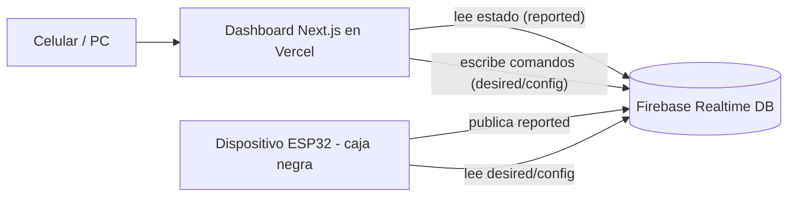

# Dashboard de control de tanque — Especificación de la app web

> Documento de handoff **solo para el desarrollo de la aplicación web**. Cubre el dashboard alojado en **Vercel** y su backend en **Firebase**. El hardware (ESP32, sensores, cableado) y el firmware del dispositivo son ajenos a este documento: aquí el dispositivo se trata como una **caja negra** que se sincroniza con Firebase.

---

## 1. Objetivo

Construir un dashboard web que permita **monitorear** y **controlar a distancia** uno o varios tanques de agua. El dashboard lee el estado que el dispositivo publica en Firebase y le envía comandos (encender/apagar, cambiar de modo, ajustar umbrales).

El sistema físico controla **1 o 2 actuadores** (una bomba, una electroválvula, o ambas a la vez). La app debe adaptar su interfaz a la configuración de cada tanque.

---

## 2. Alcance

**Incluye:** UI del dashboard, autenticación, lectura/escritura en Firebase, control remoto, alertas, configuración, despliegue en Vercel.

**No incluye (otro documento):** electrónica, conexión de pines, programación del ESP32, instalación eléctrica.

> El único punto de contacto entre la app y el hardware es el **contrato de datos en Firebase** (sección 6). Si la app respeta ese contrato, funciona sin saber nada del dispositivo.

---

## 3. Stack tecnológico

| Capa | Tecnología |
|---|---|
| Frontend / hosting | **Next.js** (App Router) desplegado en **Vercel** |
| Base de datos en tiempo real | **Firebase Realtime Database** |
| Autenticación | **Firebase Authentication** |
| SDK | **Firebase Web SDK v9+** (modular) |
| Gráficas | Recharts o Chart.js |
| Estilos | A elección (Tailwind sugerido) |

---

## 4. Arquitectura (desde la app)



- La app **escribe** en `config/` y `desired/`.
- La app **lee** de `reported/`, `alerts/`, `events/`, `history/`.
- El dispositivo hace lo inverso. La app no necesita conocer su lógica interna.
- Toda la comunicación es **en tiempo real** mediante listeners de Firebase (no polling).

---

## 5. Autenticación y roles

- **Firebase Authentication** obligatorio. Método sugerido: email/contraseña (o enlace mágico). Anónimo no recomendado para control de actuadores.
- Roles mínimos:
  - **admin**: ve y controla, edita configuración, gestiona usuarios.
  - **operador**: ve y controla (on/off, modo), sin editar configuración crítica.
  - **lectura**: solo monitoreo.
- El rol puede guardarse como *custom claim* o en `/users/{uid}` dentro de la base.
- Cada usuario tiene acceso solo a los tanques que le corresponden (ver reglas de seguridad).

---

## 6. Contrato de datos (Firebase Realtime Database)

Estructura por tanque, patrón **desired / reported**:

```
/tanks/{tankId}/
  meta/
    name: "Tanque Cantón X"
    location: "..."
  config/                      # LA APP ESCRIBE
    mode: "auto"               # "auto" | "manual"
    startPct: 30               # umbral de encendido
    stopPct: 90                # umbral de apagado
    actuators:
      pump:  { enabled: true }
      valve: { enabled: false }
    actuationStrategy: "single"   # "single" | "both" | "priority"
  desired/                     # LA APP ESCRIBE (comandos)
    pumpManual: null           # true | false | null   (solo en modo manual)
    valveManual: null
    requestedMode: null        # "auto" | "manual" | null
  reported/                    # LA APP LEE (estado del dispositivo)
    levelPct: 62
    distanceCm: 49
    pumpOn: false
    valveOn: false
    cisternHasWater: true
    online: true
    lastSeen: 1730000000       # epoch (s) — para online/offline
    sensorHealth: { invalidRatePct: 1.2, noiseStd: 0.4, status: "ok" }  # "ok"|"degraded"
    mode: "auto"               # modo realmente aplicado por el dispositivo
  alerts/                      # LA APP LEE
    {alertId}: { code: "DRY_RUN", message: "...", ts: 1730000000, active: true }
  events/                      # LA APP LEE (bitácora)
    {eventId}: { ts: ..., type: "PUMP_ON" | "ALERT" | "MODE_CHANGE" | ..., detail: "..." }
  history/                     # LA APP LEE (gráficas)
    {ts}: { levelPct: 62 }
/users/{uid}/
  role: "admin" | "operador" | "lectura"
  tanks: { {tankId}: true }    # tanques a los que tiene acceso
```

### Reglas de escritura (importante)
- La app **nunca** escribe en `reported/`, `alerts/`, `events/`, `history/` (son del dispositivo).
- El dispositivo **nunca** escribe en `config/` ni `desired/`.
- Esta separación se refuerza en las reglas de seguridad (sección 7).

### Códigos de alerta esperados
`DRY_RUN` (cisterna vacía), `NO_PRESSURE` (sin presión en la red), `OVERFLOW` (sobrenivel), `SENSOR_FAULT` (sensor con fallas), `OFFLINE` (dispositivo sin conexión — la app puede derivarla de `lastSeen`).

---

## 7. Reglas de seguridad de Firebase (ejemplo)

```json
{
  "rules": {
    "tanks": {
      "$tankId": {
        ".read": "auth != null && root.child('users').child(auth.uid).child('tanks').child($tankId).val() === true",
        "config":  { ".write": "auth != null && root.child('users').child(auth.uid).child('role').val() !== 'lectura'" },
        "desired": { ".write": "auth != null && root.child('users').child(auth.uid).child('role').val() !== 'lectura'" },
        "reported": { ".write": "false" },
        "alerts":   { ".write": "false" },
        "events":   { ".write": "false" },
        "history":  { ".write": "false" }
      }
    }
  }
}
```

> El acceso de escritura del **dispositivo** se maneja con credencial/servicio aparte (no es responsabilidad de la app). La app solo se preocupa por las reglas de los usuarios.

---

## 8. Funcionalidad del dashboard — Núcleo (v1)

### 8.1 Monitoreo en vivo
- Nivel del tanque: porcentaje grande + barra/indicador visual.
- Estado del/los actuador(es): ON/OFF (mostrar solo los actuadores `enabled`).
- Estado del modo actual (Auto/Manual) según `reported/mode`.
- Estado de la cisterna (`cisternHasWater`) cuando hay bomba.
- Salud del sensor: OK / degradándose (`sensorHealth.status`).
- Estado de conexión del dispositivo: **online/offline** (ver sección 10).

### 8.2 Control remoto
- Conmutador **Auto / Manual** → escribe `desired/requestedMode`.
- En **Manual**: botones de encender/apagar por actuador → `desired/pumpManual`, `desired/valveManual`.
- La UI debe reflejar el estado **confirmado** (`reported/pumpOn`, etc.), no solo el comando enviado. Mostrar un estado intermedio "enviando…" hasta que `reported` confirme.

### 8.3 Configuración
- Editar umbrales `startPct` / `stopPct` (con validación: 0 < start < stop ≤ 100).
- Seleccionar actuadores activos (bomba, válvula o ambas) → `config/actuators`.
- Seleccionar estrategia cuando hay dos (`actuationStrategy`).
- Solo visible/editable para roles admin/operador según corresponda.

### 8.4 Alertas
- Panel de alertas activas (lee `alerts/` donde `active === true`).
- Diferenciación visual por severidad/código.

### 8.5 Adaptabilidad de la UI
- Si `config/actuators.pump.enabled === false`, no mostrar controles de bomba (igual para válvula).
- Si solo hay un actuador, simplificar la vista.

---

## 9. Funcionalidad — Futuro (v2+)

- **Histórico y gráficas** de nivel (consumo por hora/día) leyendo `history/`.
- **Bitácora de eventos** (`events/`) con filtros por tipo/fecha.
- **Notificaciones** push / email / Telegram ante alertas (vía Cloud Functions).
- **Multi-tanque**: listado de todos los tanques del usuario con su estado resumido.
- **Multiusuario y roles** con gestión desde la app (admin invita/asigna).
- **Mantenimiento predictivo**: vista de tendencia de `sensorHealth` que sugiere reemplazo del sensor.

---

## 10. Detección online / offline

Firebase no marca el dispositivo como offline por sí solo. La app lo deriva:

- El dispositivo actualiza `reported/lastSeen` periódicamente (heartbeat).
- La app considera **offline** si `now - lastSeen > UMBRAL` (sugerido 60 s).
- Mostrar claramente el estado offline y deshabilitar los controles de comando mientras lo esté (con aviso "dispositivo sin conexión; el control opera localmente").

---

## 11. Flujo de comandos (desired / reported)

1. El usuario pulsa "Encender bomba".
2. La app escribe `desired/pumpManual = true`.
3. La UI muestra estado "enviando…".
4. El dispositivo ejecuta (respetando sus protecciones) y actualiza `reported/pumpOn`.
5. La app, por su listener en `reported/`, confirma y actualiza el estado visual.
6. Si tras un timeout no hay confirmación, la app muestra "sin confirmación" (posible offline o protección que impidió la acción, p. ej. anti-marcha en seco).

> Importante: un comando puede **no** ejecutarse si una protección del dispositivo lo impide. La app debe reflejar siempre `reported/`, no asumir que el comando tuvo efecto.

---

## 12. Estructura de rutas sugerida (Next.js)

```
/login                  # autenticación
/                       # listado de tanques (multi-tanque) o redirección
/tank/[tankId]          # dashboard del tanque (monitoreo + control)
/tank/[tankId]/config   # configuración (admin/operador)
/tank/[tankId]/history  # histórico y gráficas (v2)
/settings/users         # gestión de usuarios (admin, v2)
```

---

## 13. Ejemplos de integración (Firebase Web SDK v9)

**Escuchar el estado en tiempo real:**
```js
import { getDatabase, ref, onValue } from "firebase/database";
const db = getDatabase();
onValue(ref(db, `tanks/${tankId}/reported`), (snap) => {
  const state = snap.val();   // { levelPct, pumpOn, online, lastSeen, ... }
  // actualizar UI
});
```

**Enviar un comando:**
```js
import { ref, update } from "firebase/database";
await update(ref(db, `tanks/${tankId}/desired`), { pumpManual: true });
```

**Editar configuración:**
```js
await update(ref(db, `tanks/${tankId}/config`), { startPct: 25, stopPct: 85 });
```

---

## 14. Variables de entorno (Vercel)

```
NEXT_PUBLIC_FIREBASE_API_KEY=
NEXT_PUBLIC_FIREBASE_AUTH_DOMAIN=
NEXT_PUBLIC_FIREBASE_DATABASE_URL=
NEXT_PUBLIC_FIREBASE_PROJECT_ID=
NEXT_PUBLIC_FIREBASE_APP_ID=
```

- Configurarlas en el panel de Vercel (Environment Variables), nunca en el repositorio.
- Las claves `NEXT_PUBLIC_*` son visibles en el cliente (es normal en Firebase); la seguridad real la dan las **reglas** de la base, no el ocultamiento de la API key.

---

## 15. Requisitos no funcionales

- **Responsive**: uso principal desde celular.
- **Tiempo real**: actualizaciones por listeners, sin recargar.
- **Latencia de comando**: confirmar estado en pocos segundos; manejar timeouts con mensajes claros.
- **Tolerancia a desconexión**: la app no debe romperse si el dispositivo está offline; debe informarlo.
- **Accesibilidad**: contraste, etiquetas, navegación por teclado.
- **i18n**: textos en español (Guatemala).

---

## 16. Despliegue en Vercel

- Proyecto Next.js conectado al repositorio.
- Variables de entorno configuradas en Vercel.
- Reglas de seguridad de Firebase publicadas **antes** de exponer la app.
- Dominio asignado (o el de Vercel).

---

## 17. Preguntas abiertas (app)

1. ¿Se necesita multi-tanque desde la v1 o un solo tanque al inicio?
2. ¿Qué canal de notificaciones se prioriza (push web, email, Telegram)?
3. ¿Gestión de usuarios desde la app o manual en consola de Firebase al inicio?
4. ¿Se requiere modo "solo lectura" público (sin login) para la comunidad?
5. Política de timeout de comando y de heartbeat (coordinar con el equipo de firmware).

---

## 18. Roadmap sugerido (app)

1. **v1**: login + dashboard de un tanque (monitoreo en vivo, control auto/manual, umbrales, alertas, online/offline).
2. **v1.1**: adaptación a 1 o 2 actuadores y estrategias.
3. **v2**: histórico/gráficas + bitácora.
4. **v2.1**: notificaciones (Cloud Functions).
5. **v3**: multi-tanque, multiusuario y roles gestionados desde la app, mantenimiento predictivo.
